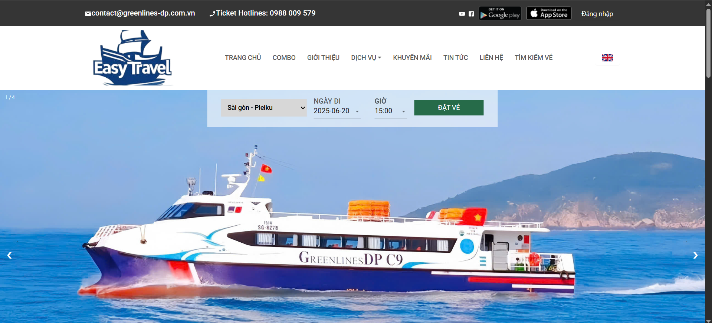
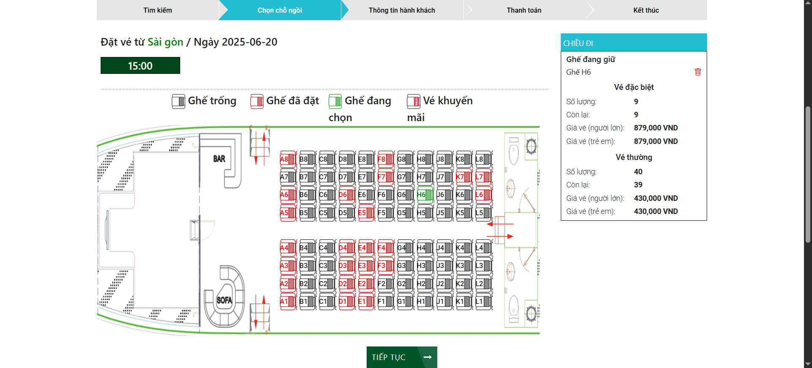

Hệ thống đặt vé tàu online - Easy Travel
- Ứng dụng được code theo mô hình Client-Side Rendering và Restful API
  + Gồm 2 client page là User page và Admin page.
  + Ứng dụng User page có đầy đủ các tính năng cơ bản của 1 web đặt vé online từ giữ chỗ tới thanh toán (bằng Momo sandbox)...
  + Admin page có thể quản lý dòng tiền cũng như là lượng user và các tuyến đường... có các biểu đồ (chart) để theo dõi hiệu suất của hệ thống.

